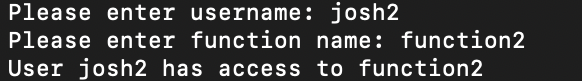

### About - PHP CLI app - Access control :closed_lock_with_key:

Application was written to present coding skills, is written in php 8.0 and requires php 8.0 to run.

App checks if there is access to function by specified user.

Users can be grouped in groups.
Functions can be grouped in groups called modules.
Right can be granted to whole module that means all functions connected with module.
Right can be granted to one function

### Setup :coffee:
1. Install php 8.0
2. Install mysql
3. Create database and user
4. Import database from file `database.sql`
5. Edit file `src/.env` and set database credentials

### How to run cli app :golfing: 
1. Clone repository
2. open terminal in project directory
3. run command `php src/boot.php` to run app
4. enter username
5. enter function name
6. result will be displayed

This how it looks like on running app:
